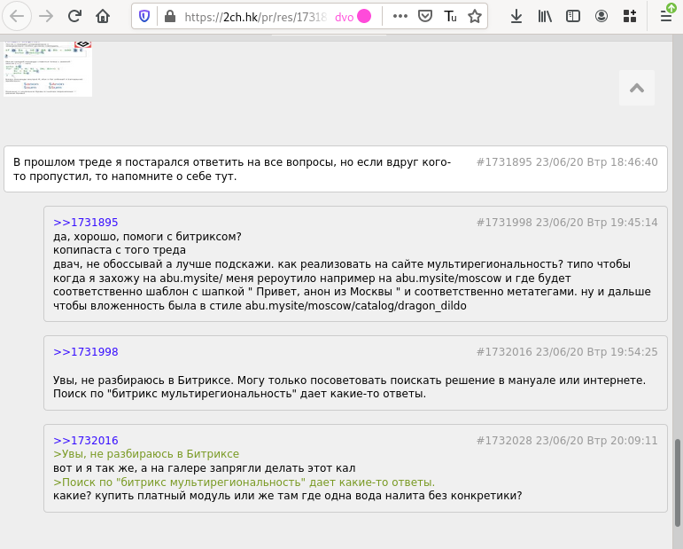

# Раскатыватель тредов

Группирует ответы под постом, к которому они относятся, что должно облегчать просмотр больших тредов.

Чтобы установить это расширение, клонируйте или скачайте репозиторий. В адресной строке Firefox наберите about:debugging -> Загрузить временное дополнение и выберите файл extension/manifest.json. После этого при заходе на имиджборду в адресной строке появится кнопочка: 

Нажмите её и тред будет выглядеть так: 

